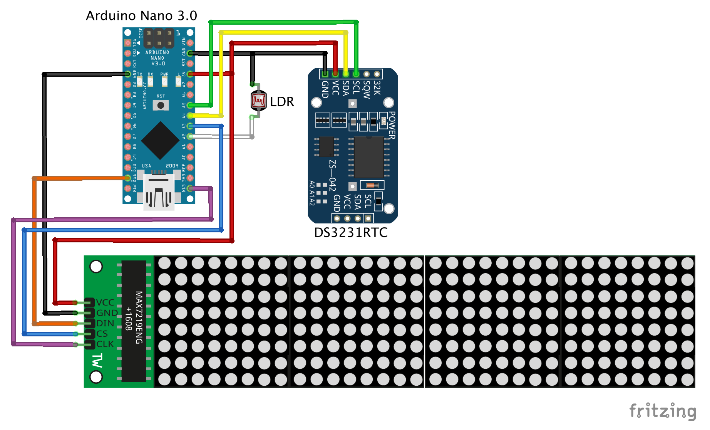
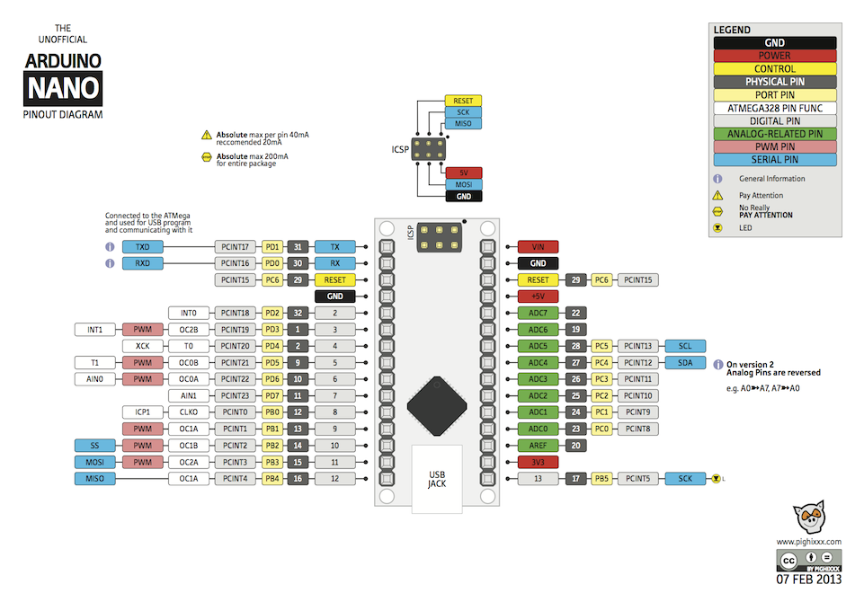

# Arduino 32x8 LED Dot Matrix Clock

A simple LED dot matrix clock project based on Arduino Nano.

#### Schematics:

###### Arduino Nano 3.0:

#### Parts:
* Arduino Nano 3.0 (ATmega328).
* Real Time Clock DS3231RTC.
* 32x8 LED Dot Matrix Display Module (with MAX7219 chip).
* LDR sensor.